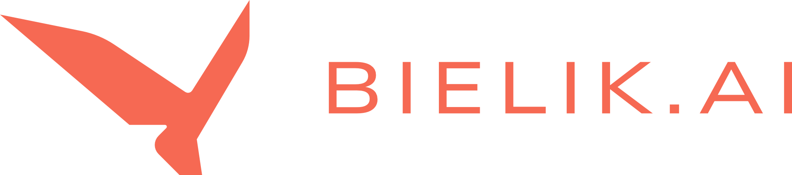
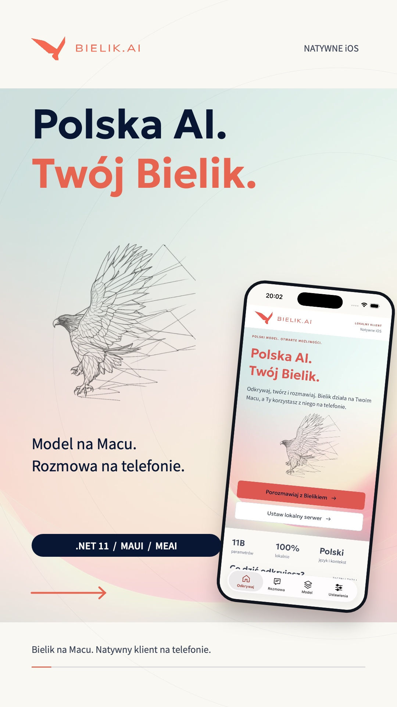
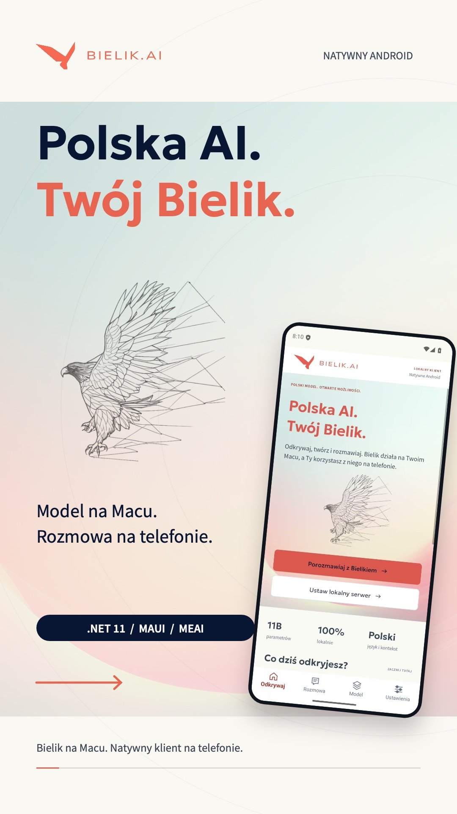

<p align="center">
  
</p>

<h1 align="center">Bielik MAUI</h1>

<p align="center">
  A native Polish-language companion for Bielik, inspired by <a href="https://bielik.ai/">bielik.ai</a>.
  <br />
  <strong>.NET 11 &middot; iOS &amp; Android &middot; MEAI &middot; Local Bielik</strong>
</p>

<p align="center">
  <a href="#get-started">Get started</a> &middot;
  <a href="docs/development.md">Developer guide</a> &middot;
  <a href="media">All screenshots &amp; videos</a>
</p>

## See it in action

Two **30-second, 60 fps reels**: animated typography, native UI close-ups, and an original soundtrack. The chat footage shows a real local Bielik response, not a mocked conversation.

<table>
  <tr>
    <th align="center">iOS</th>
    <th align="center">Android</th>
  </tr>
  <tr>
    <td align="center">
      <a href="media/demos/ios-demo.mp4">
        
      </a>
    </td>
    <td align="center">
      <a href="media/demos/android-demo.mp4">
        
      </a>
    </td>
  </tr>
  <tr>
    <td align="center">
      <a href="media/demos/ios-demo.mp4">Watch the reel</a> &middot;
      <a href="media/demos/ios-raw.mp4">Raw screen recording</a>
    </td>
    <td align="center">
      <a href="media/demos/android-demo.mp4">Watch the reel</a> &middot;
      <a href="media/demos/android-raw.mp4">Raw screen recording</a>
    </td>
  </tr>
</table>

## What's inside

- **Discover Bielik** with official website artwork, coral accents and native controls.
- **Chat in Polish** with streaming replies, conversation memory, copy and stop controls.
- **Explore the model** and see the app's MEAI integration and platform capabilities.
- **Connect locally** to your own Ollama server; messages stay in app memory.

> [!IMPORTANT]
> Bielik runs in **Ollama on your Mac**, not on the phone. Both apps use MEAI to talk to the same local **Bielik 11B v2.6 (Q4_K_M)** model. There is no alternate model or cloud fallback.

## Get started

You'll need macOS, the [.NET 11 SDK pinned in this project](global.json), [Ollama](https://ollama.com/), and the platform toolchains. See [requirements](docs/development.md#requirements) for exact versions. The model download is approximately **6.7 GB**.

### 1. Get the app

```bash
git clone https://github.com/kubaflo/bielik-maui.git
cd bielik-maui
dotnet workload restore Bielik/Bielik.csproj
dotnet tool restore
```

### 2. Start local Bielik

Start the local server in one terminal, or reuse it if already running on this address:

```bash
OLLAMA_HOST=127.0.0.1:11434 OLLAMA_NO_CLOUD=1 ollama serve
```

In another terminal, download the exact model:

```bash
OLLAMA_HOST=127.0.0.1:11434 \
  ollama pull hf.co/speakleash/Bielik-11B-v2.6-Instruct-GGUF:Q4_K_M
```

### 3. Launch on your platform

| Platform | Build and install | Default local server in Debug |
| --- | --- | --- |
| iOS 17+ | [iOS simulator guide](docs/development.md#build-and-install-on-ios) | `http://127.0.0.1:11434` |
| Android API 24+ | [Android emulator guide](docs/development.md#build-and-install-on-android) | `http://10.0.2.2:11434` |

In the app, open **Ustawienia** to check the connection, then **Rozmowa** to chat.

The SDK is a preview. Physical phones require additional setup; Release uses HTTPS. [Build commands, troubleshooting, checks and recordings](docs/development.md) live in the developer guide.

## About

This is an **unofficial companion**, not a SpeakLeash product. Chat uses `Microsoft.Extensions.AI`; MAUI Essentials AI is used for capability diagnostics, not to replace Bielik. It currently has no native Android provider. [AI integration details](docs/development.md#meai-and-maui-essentials-ai).

Application source is [MIT licensed](LICENSE). Official Bielik artwork and bundled fonts retain their original rights and licenses; see [credits and notices](Bielik/Resources/Raw/third_party_notices.txt). Model weights are downloaded separately under Apache-2.0.
