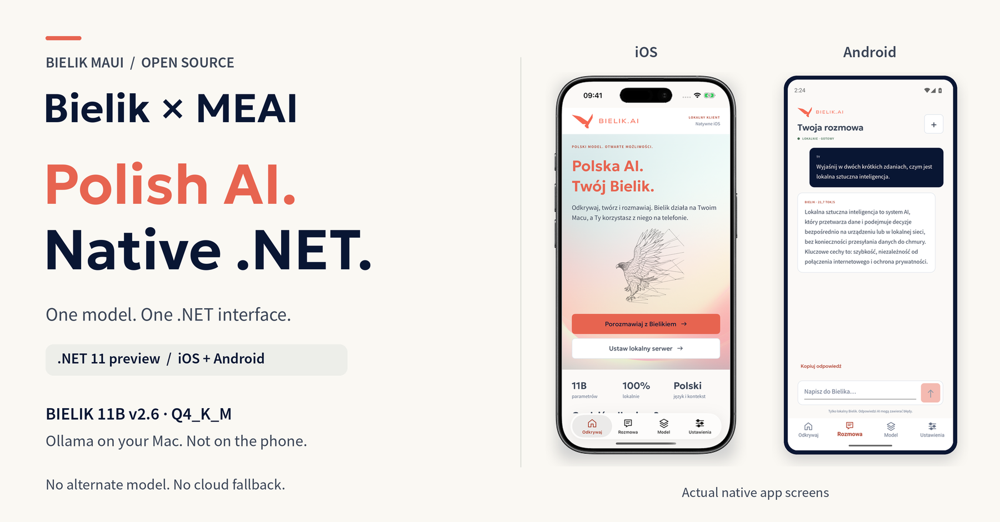

<h1 align="center">Bielik MAUI</h1>

<p align="center">
  <strong>Bielik speaks Polish. MEAI speaks .NET. One app brings them together.</strong>
</p>

<p align="center">
  
</p>

<p align="center">
  <a href="global.json"></a>
  <a href="docs/development.md#build-and-install-on-ios"></a>
  <a href="docs/development.md#build-and-install-on-android"></a>
  <a href="https://learn.microsoft.com/dotnet/ai/microsoft-extensions-ai"></a>
  <a href="LICENSE"></a>
</p>

<p align="center">
  <a href="#watch-it-in-action">Watch the demos</a> &middot;
  <a href="#get-started">Get started</a> &middot;
  <a href="#the-meai-bridge">Explore the code</a> &middot;
  <a href="docs/development.md">Developer guide</a> &middot;
  <a href="docs/promotion.md#linkedin">LinkedIn post: PL / EN</a>
</p>

> [!IMPORTANT]
> Bielik runs in **Ollama on your Mac**, not on the phone. Both apps use MEAI to talk to the same local **Bielik 11B v2.6 (Q4_K_M)** model. There is no alternate model or cloud fallback.

## Watch it in action

**Press play below.** Two 35-second demos bring together real native app recordings, the actual C# integration and a streamed Bielik reply. Both are **1080 × 1920 at 60 fps**, with an original soundtrack.

<table>
  <tr>
    <th align="center">iOS &middot; Bielik on iPhone</th>
    <th align="center">Android &middot; Bielik on Pixel</th>
  </tr>
  <tr>
    <td width="50%" valign="top">

https://github.com/user-attachments/assets/5a3c4f0a-98b3-419e-8f1b-cd8232c53687

</td>
    <td width="50%" valign="top">

https://github.com/user-attachments/assets/dc7c62ad-c9d2-4cf4-ba29-2e5242865453

</td>
  </tr>
  <tr>
    <td align="center">
      <a href="media/demos/ios-demo.mp4">Download the demo</a> &middot;
      <a href="media/demos/ios-raw.mp4">Raw screen recording</a>
    </td>
    <td align="center">
      <a href="media/demos/android-demo.mp4">Download the demo</a> &middot;
      <a href="media/demos/android-raw.mp4">Raw screen recording</a>
    </td>
  </tr>
</table>

Recorded on an iOS simulator and Android emulator. The edited demos show Mac-based inference, not an 11B model running on a phone. [Original recordings and editing provenance](docs/development.md#reels-style-demos).

## Polish model. Shared .NET API. Native apps.

| Bielik | Microsoft.Extensions.AI | .NET MAUI |
| --- | --- | --- |
| Polish-language, open-weight **11B v2.6** model | **`IChatClient`**, typed streaming updates and cancellation | One shared C# chat view model, **two native interfaces** |
| The exact **Q4_K_M** weights in local Ollama | A `BielikChatClient` adapter, not a second model | iOS and Android, with packaged artwork and native controls |

Discover Bielik, choose a Polish prompt, watch the reply arrive, stop generation or copy the result. Conversation memory stays in the app; only the local server address is saved.

## The MEAI bridge

```text
iOS / Android → IChatClient → BielikChatClient → Ollama on your Mac → Bielik 11B
```

The UI consumes the standard MEAI interface, not a platform-specific model API:

```csharp
await foreach (var update in _chatClient.GetStreamingResponseAsync(
    conversation, cancellationToken: cancellation.Token))
{
    text.Append(update.Text);
    answer.Text = text.ToString();
}
```

Excerpt from the [actual chat view model](Bielik/ViewModels/ChatViewModel.cs); completion and token-metric handling follow the displayed statements. Explore the [provider adapter](Bielik.Core/BielikChatClient.cs) and its [DI registration](Bielik/MauiProgram.cs).

**MEAI and MAUI Essentials AI are different layers.** Chat uses `Microsoft.Extensions.AI`. `Microsoft.Maui.Essentials.AI` is used only for capability diagnostics; Apple Intelligence never replaces Bielik, and there is no native Android provider in the pinned package. [Integration details](docs/development.md#meai-and-maui-essentials-ai).

## Get started

Bring a **Mac**, the [.NET 11 preview SDK pinned here](global.json), [Ollama](https://ollama.com/) and the [platform toolchains](docs/development.md#requirements). The model download is approximately **6.7 GB**.

### 1. Get the app

```bash
git clone https://github.com/kubaflo/bielik-maui.git
cd bielik-maui
dotnet workload restore Bielik/Bielik.csproj
dotnet tool restore
```

### 2. Start local Bielik

Start the local server in one terminal, or reuse it if already running on this address:

```bash
OLLAMA_HOST=127.0.0.1:11434 OLLAMA_NO_CLOUD=1 ollama serve
```

In another terminal, download the exact model:

```bash
OLLAMA_HOST=127.0.0.1:11434 \
  ollama pull hf.co/speakleash/Bielik-11B-v2.6-Instruct-GGUF:Q4_K_M
```

### 3. Launch on your platform

| Platform | Build and install | Default local server in Debug |
| --- | --- | --- |
| iOS 17+ | [iOS simulator guide](docs/development.md#build-and-install-on-ios) | `http://127.0.0.1:11434` |
| Android API 24+ | [Android emulator guide](docs/development.md#build-and-install-on-android) | `http://10.0.2.2:11434` |

In the app, open **Ustawienia** to check the connection, then **Rozmowa** to chat.

> [!NOTE]
> These steps target local simulators/emulators. Physical phones need additional networking and signing setup; Release requires HTTPS. The SDK and MAUI packages are previews.

<details>
<summary><strong>More to explore</strong> — documentation, media and promotional assets</summary>

| Resource | What's inside |
| --- | --- |
| [Developer guide](docs/development.md) | Build commands, local model setup, troubleshooting and recorded checks |
| [Screenshots and recordings](media) | Original native captures, raw recordings and edited demos |
| [LinkedIn kit](docs/promotion.md#linkedin) | Polish and English posts, plus the framed screenshot image |
| [Gemini kit](media/gemini-reel/bielik-meai-gemini-kit.zip) | Raw screenshots and prompts for a separate 30-second video |

</details>

## Credits & license

An **unofficial, open-source integration sample**, not a SpeakLeash or Microsoft product or endorsement.

Application source is [MIT licensed](LICENSE). Official Bielik artwork, the user-supplied iPhone frame and bundled fonts retain their original rights; see [credits and notices](Bielik/Resources/Raw/third_party_notices.txt), [frame attribution](docs/promotion.md#linkedin) and [header provenance](media/readme/bielik-meai-hero.json). Model weights are downloaded separately under Apache-2.0.

<p align="center">
  <a href="https://bielik.ai/"><strong>Discover Bielik</strong></a> &middot;
  <a href="https://learn.microsoft.com/dotnet/ai/microsoft-extensions-ai"><strong>Explore MEAI</strong></a> &middot;
  <a href="#get-started"><strong>Build the app</strong></a>
</p>
